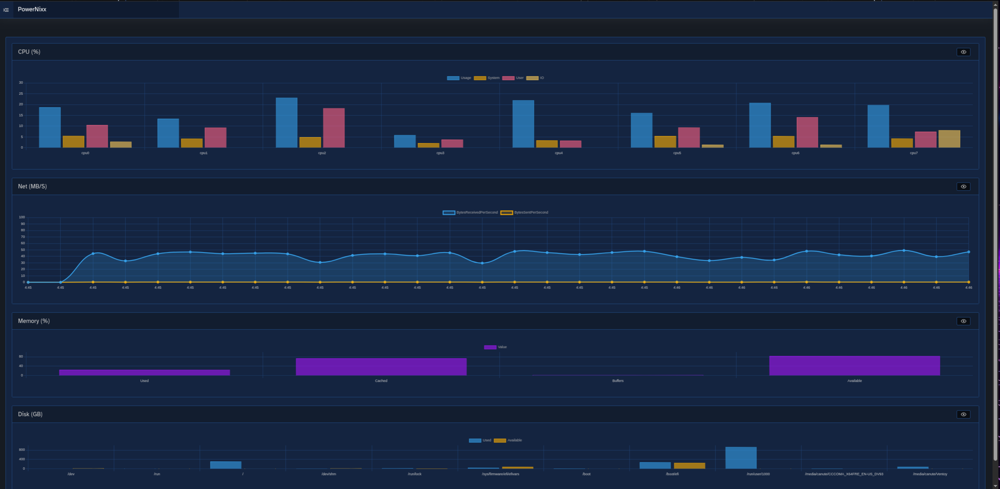

# PowerNixx

PowerNixx helps you monitor your Linux systems with Powershell and .NET 

# Quick Start
```powershell
Install-Module psake
Import-Module psake
Invoke-psake -buildFile .\powernixx.build.ps1 -taskList Install
Import-Module .\PowerNixx.psd1
```

In ```\Config\CurrentProfile.ps1``` change the PowerNixx location to your on disk install directory. 


```powershell
& .\Config.ps1
```

## Purpose

PowerNixx is built on Pode.Web and currently provides the following features
- JSON APIs providing structured data access to the system under monitor
- A default dashboard with the 4 most common system monitoring metrics: CPU, Memory, Disk, and Network
- Tools for hashing, encryption, archiving, and compressing data
- Powershell wrappers for local LLM frameworks like **Ollama** and **llama.cpp**

## Web Dashboard
1. Metrics




